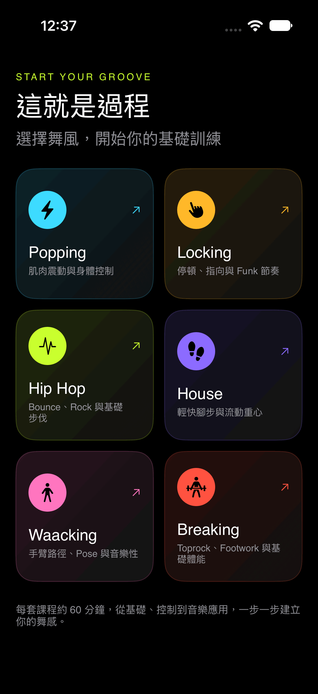
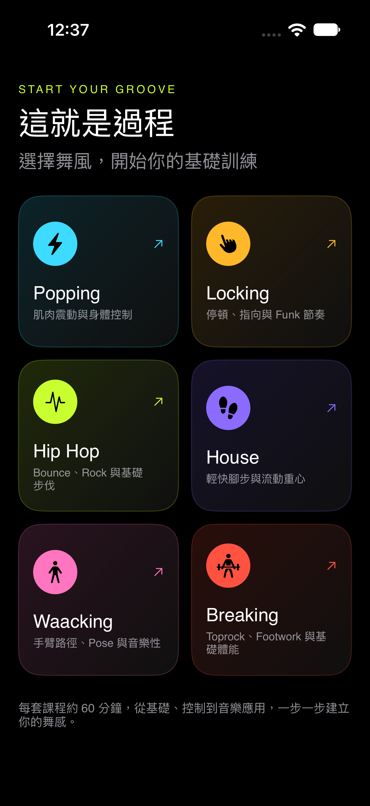
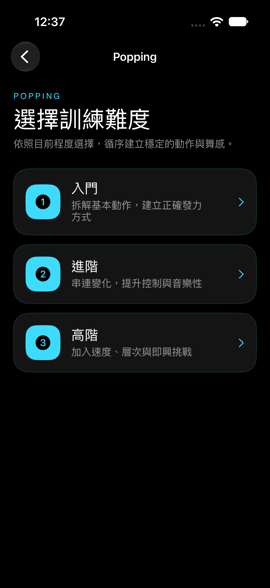
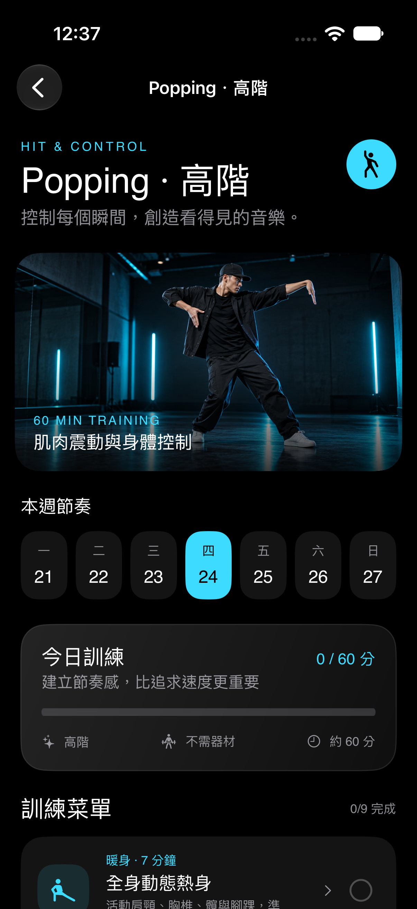

# ⚡ Start Your Groove

### Turn “What should I practice today?” into a complete street-dance session.

[🇺🇸 English](#english) · [🇹🇼 中文](#中文)

---

## 🇺🇸 English

### 💡 Why I Built This

When practicing alone, it is easy to get stuck on two questions: **Where should I start today?** and **How can I organize a complete session?**

Start Your Groove combines my street-dance experience with software design to provide a clear, practical training path. Instead of improvising a routine every time, dancers can choose a style and level, then follow a structured session from warm-up to musical application.

### ✨ Highlights

- 🕺 **Six dance styles** — Popping, Locking, Hip Hop, House, Waacking, and Breaking
- 📈 **Three difficulty levels** — Beginner, Intermediate, and Advanced
- ⏱️ **Complete 60-minute plans** — A balanced session instead of disconnected drills
- ✅ **Progress tracking** — Mark exercises complete and see finished minutes at a glance
- 🧩 **Step-by-step guidance** — Training goals, movement breakdowns, and common mistakes
- 🎵 **Learning resources** — Curated music and studio recommendations for continued practice
- 🌙 **Focused dark interface** — Color-coded styles with a bold, dance-inspired visual system

### 📱 App Preview

  
  &nbsp;
  
  &nbsp;
  

### 🧭 Training Flow

`Choose a style` → `Select your level` → `Follow today's plan` → `Track your progress`

### 🛠️ Built With

- Swift
- SwiftUI
- SF Symbols
- Xcode

### 🚀 Run the Project

1. Clone or download this repository.
2. Open `Untitled Project.xcodeproj` in Xcode.
3. Select an iPhone simulator or connected device.
4. Build and run with `⌘R`.

---

## 🇹🇼 中文

### 💡 開發動機

有時候想自己練習街舞，卻不知道今天該從哪個基礎開始，也不確定該怎麼安排一套比較完整的訓練。

因此，我把平常跳舞的經驗和程式設計結合，做出 **Start Your Groove**。使用者只要選擇舞風與程度，就能依照清楚的訓練流程，從暖身、基礎控制一路練到音樂應用，不必每次都重新煩惱今天要練什麼。

### ✨ 特色功能

- 🕺 **六種街舞風格** — Popping、Locking、Hip Hop、House、Waacking、Breaking
- 📈 **三級訓練難度** — 入門、進階、高階，依程度循序練習
- ⏱️ **完整 60 分鐘課表** — 將分散的動作練習整理成有結構的訓練
- ✅ **即時進度追蹤** — 勾選已完成項目，快速掌握完成數量與時間
- 🧩 **動作拆解教學** — 提供練習目標、步驟說明與常見錯誤
- 🎵 **延伸學習資源** — 搭配音樂歌單與舞蹈教室推薦
- 🌙 **沉浸式深色介面** — 用不同亮色識別舞風，呈現鮮明的街舞視覺

### 📱 App 畫面

  
  &nbsp;
  
  &nbsp;
  

### 🧭 使用流程

`選擇舞風` → `選擇難度` → `跟著今日課表練習` → `記錄完成進度`

### 🛠️ 使用技術

- Swift
- SwiftUI
- SF Symbols
- Xcode

### 🚀 執行方式

1. Clone 或下載此專案。
2. 使用 Xcode 開啟 `Untitled Project.xcodeproj`。
3. 選擇 iPhone 模擬器或已連接的實機。
4. 按下 `⌘R` 建置並執行。

---

### 🎧 Pick a style. Build your foundation. Find your groove.

[⬆️ Back to top](#-start-your-groove)

